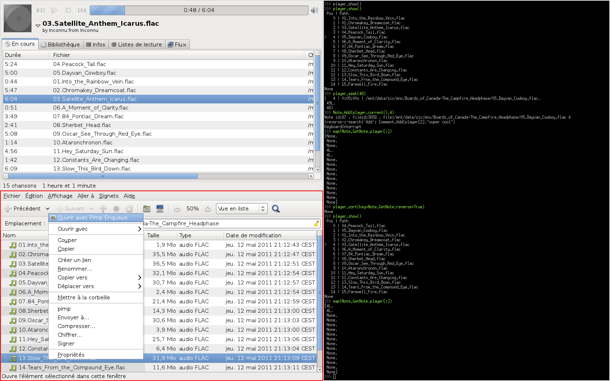

.. Pimp documentation master file, created by
   sphinx-quickstart on Wed Jul 20 17:44:46 2011.
   You can adapt this file completely to your liking, but it should at least
   contain the root `toctree` directive.

Pimp : Python Interactive Music Player
======================================
.. include:: readme.rst

Screenshot
==========

   Pimp interpreter with sonata and nautilus.

More Information
================
.. toctree::
   :maxdepth: 2

   install
   reference
   script_readme

Indices and tables
==================

* :ref:`genindex`
* :ref:`modindex`
* :ref:`search`

